# Design Document: Landing Page Redesign

## Overview

This design transforms the current landing page into a modern, futuristic experience that captivates users through cutting-edge visual design, smooth animations, and professional scrolling effects. The approach balances innovation with usability, creating an engaging interface that feels contemporary and dynamic while maintaining excellent performance and accessibility. The redesign leverages modern web technologies to deliver a premium, interactive experience that positions the platform as innovative and forward-thinking.

## Architecture

### Component Architecture

```mermaid
graph TD
    A[Landing Page Shell] --> B[Header Navigation]
    A --> C[Hero Section]
    A --> D[Value Proposition Grid]
    A --> E[Product Showcase]
    A --> F[Social Proof Section]
    A --> G[Feature Comparison]
    A --> H[Footer]
    
    B --> B1[Logo]
    B --> B2[Navigation Menu]
    B --> B3[CTA Button]
    
    C --> C1[Headline]
    C --> C2[Subheadline]
    C --> C3[Primary CTA]
    C --> C4[Product Preview]
    
    D --> D1[Benefit Cards]
    D --> D2[Feature Highlights]
    
    E --> E1[Screenshot Gallery]
    E --> E2[Feature Callouts]
    E --> E3[Demo Video]
    
    F --> F1[Customer Testimonials]
    F --> F2[Usage Statistics]
    F --> F3[Customer Logos]
    
    G --> G1[Feature Matrix]
    G --> G2[Pricing Information]
```



### Layout System

The design uses a **modern, fluid grid system** with dynamic visual effects:

- **Primary Grid**: 12-column responsive grid with smooth breakpoint transitions
- **Content Zones**: Asymmetrical layouts with varied widths for visual interest
- **Vertical Rhythm**: Dynamic section heights with scroll-triggered reveals
- **Whitespace Strategy**: Generous spacing with breathing room for animations
- **Depth Layers**: Z-axis positioning for parallax and layering effects

### Visual Hierarchy

1. **Typography Scale**: Fluid typography with gradient text effects and kinetic animations
2. **Color Hierarchy**: Modern gradients, glassmorphism, and depth through shadows
3. **Spatial Hierarchy**: Layered content with parallax scrolling and z-axis positioning
4. **Motion Hierarchy**: Staggered animations that guide user attention naturally
5. **Interactive Hierarchy**: Clear visual feedback through micro-interactions and hover effects

## Animation System

### Animation Principles

**Performance-First Approach**:
- GPU-accelerated animations using CSS transforms and opacity
- RequestAnimationFrame for JavaScript animations
- Intersection Observer API for scroll-triggered effects
- Debounced scroll handlers for optimal performance

**Animation Types**:

1. **Entrance Animations**
   - Fade-in with slide-up (staggered timing)
   - Scale and fade for cards and elements
   - Text reveal animations for headlines
   - Duration: 400-800ms with easing

2. **Scroll-Triggered Animations**
   - Parallax effects for backgrounds and images
   - Progressive content reveals as sections enter viewport
   - Scroll-snap for smooth section transitions
   - Sticky header transformations

3. **Micro-Interactions**
   - Button hover effects (scale, shadow, gradient shift)
   - Card lift on hover with 3D transforms
   - Ripple effects on click
   - Magnetic cursor effects for CTAs
   - Duration: 150-300ms

4. **Continuous Animations**
   - Subtle gradient animations in backgrounds
   - Floating elements with gentle motion
   - Particle effects (performance-optimized)
   - Shimmer effects for loading states

### Accessibility Considerations

- Respect `prefers-reduced-motion` media query
- Provide static alternatives for all animated content
- Ensure animations don't interfere with screen readers
- Maintain keyboard navigation during animations
- Keep animation durations reasonable (< 1s for most effects)

### Animation Utilities

**Scroll Animation Hook**:
```typescript
interface UseScrollAnimationOptions {
  threshold?: number;
  rootMargin?: string;
  triggerOnce?: boolean;
  animationClass?: string;
}

function useScrollAnimation(options: UseScrollAnimationOptions): {
  ref: RefObject<HTMLElement>;
  isVisible: boolean;
  progress: number;
}
```

**Parallax Component**:
```typescript
interface ParallaxProps {
  speed?: number; // -1 to 1, negative for reverse
  children: ReactNode;
  className?: string;
  disabled?: boolean; // Respects reduced motion
}
```

## Components and Interfaces

- Respect `prefers-reduced-motion` media query
- Provide static alternatives for all animated content
- Ensure animations don't interfere with screen readers
- Maintain keyboard navigation during animations
- Keep animation durations reasonable (< 1s for most effects)

### Header Navigation Component

**Purpose**: Contextual navigation that adapts to user scroll position

**Interface**:
```typescript
interface HeaderProps {
  isScrolled: boolean;
  currentSection: string;
  navigationItems: NavigationItem[];
  ctaButton: CTAButton;
}

interface NavigationItem {
  label: string;
  href: string;
  isActive: boolean;
}
```

**Design Specifications**:
- **Background**: Glassmorphism effect with backdrop blur and gradient border
- **Typography**: Modern font stack with smooth weight transitions
- **Spacing**: 20px vertical padding, 32px horizontal margins
- **Interaction**: Smooth scale and shadow animations on scroll (200ms ease-out)
- **Sticky Behavior**: Transforms from transparent to solid background on scroll
- **Animation**: Logo scale, menu fade-in, CTA button pulse effect

### Hero Section Component

**Purpose**: Primary value proposition with authentic product preview

**Interface**:
```typescript
interface HeroProps {
  headline: string;
  subheadline: string;
  primaryCTA: CTAButton;
  secondaryCTA?: CTAButton;
  productPreview: ProductPreview;
}

interface ProductPreview {
  type: 'screenshot' | 'video' | 'interactive';
  src: string;
  alt: string;
  caption?: string;
}
```

**Design Specifications**:
- **Layout**: Asymmetrical 7/5 split with parallax background
- **Background**: Animated gradient mesh with subtle particle effects
- **Typography**: Large headline (56px) with gradient text and reveal animation
- **CTA Design**: Glassmorphic button with magnetic hover effect and ripple on click
- **Product Preview**: Floating screenshot with 3D tilt effect and subtle shadow
- **Animations**: Staggered entrance (headline → subheadline → CTA → preview)

### Value Proposition Grid Component

**Purpose**: Clear benefit communication without generic badges

**Interface**:
```typescript
interface ValueGridProps {
  benefits: Benefit[];
  layout: 'grid' | 'masonry' | 'linear';
}

interface Benefit {
  title: string;
  description: string;
  icon?: CustomIcon;
  metric?: string;
  evidence?: string;
}
```

**Design Specifications**:
- **Grid System**: CSS Grid with masonry layout and staggered entrance animations
- **Card Design**: Glassmorphism with backdrop blur, gradient borders, and depth shadows
- **Icon Treatment**: Animated custom icons with hover effects and color transitions
- **Content**: Specific benefits with fade-in animations as cards enter viewport
- **Hover Effects**: 3D card tilt, scale transform, and enhanced shadow on hover
- **Scroll Behavior**: Cards animate in with staggered timing (100ms delay between each)

### Product Showcase Component

**Purpose**: Authentic product demonstration using real screenshots

**Interface**:
```typescript
interface ProductShowcaseProps {
  screenshots: Screenshot[];
  features: FeatureCallout[];
  demoVideo?: VideoContent;
}

interface Screenshot {
  src: string;
  alt: string;
  caption: string;
  featureHighlights: FeatureHighlight[];
}

interface FeatureCallout {
  title: string;
  description: string;
  screenshotRef: string;
}
```

**Design Specifications**:
- **Image Treatment**: Real screenshots with parallax depth and smooth zoom on hover
- **Layout**: Staggered arrangement with scroll-triggered reveals
- **Annotations**: Animated callouts that appear on scroll with smooth transitions
- **Interaction**: Click to expand with smooth modal transition and backdrop blur
- **Parallax**: Screenshots move at different speeds creating depth illusion
- **Hover Effects**: Subtle scale and shadow enhancement on screenshot hover

### Social Proof Section Component

**Purpose**: Authentic customer feedback and usage metrics

**Interface**:
```typescript
interface SocialProofProps {
  testimonials: Testimonial[];
  metrics: UsageMetric[];
  customerLogos: CustomerLogo[];
}

interface Testimonial {
  quote: string;
  author: string;
  role: string;
  company: string;
  avatar?: string;
  isVerified: boolean;
}
```

**Design Specifications**:
- **Testimonial Cards**: Glassmorphic cards with smooth carousel transitions
- **Metrics Display**: Animated counters that count up when entering viewport
- **Logo Treatment**: Grayscale logos with color reveal on hover
- **Verification**: Animated checkmark badges with subtle pulse effect
- **Carousel**: Smooth auto-scroll with pause on hover and swipe gestures
- **Entrance**: Fade and slide animations for testimonials as they enter view

## Data Models

### Page Content Model

```typescript
interface LandingPageContent {
  meta: PageMeta;
  header: HeaderContent;
  hero: HeroContent;
  valueProposition: ValuePropositionContent;
  productShowcase: ProductShowcaseContent;
  socialProof: SocialProofContent;
  featureComparison: FeatureComparisonContent;
  footer: FooterContent;
}

interface PageMeta {
  title: string;
  description: string;
  keywords: string[];
  ogImage: string;
  canonicalUrl: string;
}
```

### Design System Model

```typescript
interface DesignSystem {
  colors: ColorPalette;
  typography: TypographyScale;
  spacing: SpacingScale;
  breakpoints: Breakpoints;
  animations: AnimationSettings;
  effects: VisualEffects;
}

interface ColorPalette {
  primary: ColorSet;
  secondary: ColorSet;
  accent: ColorSet;
  neutral: ColorSet;
  semantic: SemanticColors;
  gradients: GradientSet;
}

interface GradientSet {
  hero: string; // Main hero gradient
  card: string; // Card background gradient
  text: string; // Text gradient for headlines
  button: string; // Button gradient
  accent: string; // Accent gradient for highlights
}

interface AnimationSettings {
  durations: {
    fast: number; // 150ms
    normal: number; // 300ms
    slow: number; // 600ms
    verySlow: number; // 1000ms
  };
  easings: {
    easeOut: string;
    easeInOut: string;
    spring: string;
    bounce: string;
  };
  stagger: number; // Delay between staggered animations
}

interface VisualEffects {
  glassmorphism: {
    blur: string;
    opacity: number;
    border: string;
  };
  shadows: {
    sm: string;
    md: string;
    lg: string;
    xl: string;
    colored: string; // Colored shadow for depth
  };
  parallax: {
    slow: number; // 0.3
    medium: number; // 0.5
    fast: number; // 0.8
  };
}
```

### Analytics Model

```typescript
interface AnalyticsEvent {
  eventType: 'page_view' | 'section_view' | 'cta_click' | 'scroll_depth';
  timestamp: Date;
  userId?: string;
  sessionId: string;
  properties: EventProperties;
}

interface ConversionFunnel {
  step: string;
  users: number;
  conversionRate: number;
  dropoffReasons?: string[];
}
```

## Correctness Properties

*A property is a characteristic or behavior that should hold true across all valid executions of a system—essentially, a formal statement about what the system should do. Properties serve as the bridge between human-readable specifications and machine-verifiable correctness guarantees.*

### Property 1: Visual Design Authenticity
*For any* rendered page element, the visual styling should avoid AI-generated design patterns including overused gradients, uniform border radius, and excessive visual effects, instead using varied design treatments that create authentic visual hierarchy
**Validates: Requirements 1.1, 1.2, 1.3, 1.4, 1.5**

### Property 2: Content Authenticity and Specificity
*For any* text content displayed on the page, the language should be specific and concrete rather than generic, avoiding buzzwords, generic claims, and placeholder-style copy in favor of authentic user-focused messaging
**Validates: Requirements 2.1, 2.2, 2.3, 2.4, 2.5**

### Property 3: Animation Restraint and Accessibility
*For any* animated element on the page, animations should be subtle, purposeful, and respect accessibility preferences, with entrance animations limited to essential elements and interaction feedback lasting no more than 200ms
**Validates: Requirements 3.1, 3.2, 3.3, 3.4, 3.5**

### Property 4: Authentic Imagery and Media
*For any* image or media element displayed, the content should be authentic product screenshots or custom-created graphics rather than generic stock imagery or illustrations, demonstrating real platform functionality
**Validates: Requirements 4.1, 4.2, 4.3, 4.4, 4.5**

### Property 5: Distinctive Layout Structure
*For any* page section or content block, the layout should use asymmetrical, varied arrangements that break away from predictable template patterns, creating visual interest through mixed content types and varied dimensions
**Validates: Requirements 5.1, 5.2, 5.3, 5.4, 5.5**

### Property 6: Minimal Badge and Indicator Usage
*For any* status indicator or promotional element, the design should use subtle, integrated visual cues rather than excessive badges or generic promotional labels, limiting badges to essential information only
**Validates: Requirements 6.1, 6.2, 6.3, 6.4, 6.5**

### Property 7: Custom Iconography and Visual Elements
*For any* icon or visual symbol used, the element should be custom-designed or uniquely styled to match the platform's visual identity rather than using unmodified standard icon libraries or generic shapes
**Validates: Requirements 7.1, 7.2, 7.3, 7.4, 7.5**

### Property 8: Performance and Accessibility Compliance
*For any* page load or user interaction, the system should meet Core Web Vitals performance standards while ensuring full accessibility compliance including color contrast, keyboard navigation, and motion preferences
**Validates: Requirements 8.1, 8.2, 8.3, 8.4, 8.5**

### Property 9: Comprehensive Analytics Tracking
*For any* user interaction or page event, the analytics system should capture detailed engagement metrics, conversion data, and performance measurements that can be correlated with specific design elements and user behaviors
**Validates: Requirements 9.1, 9.2, 9.3, 9.4, 9.5**

## Error Handling

### Content Loading Errors

**Image Loading Failures**:
- Graceful degradation with alt text and placeholder styling
- Retry mechanism for failed image loads
- Fallback to optimized formats if modern formats fail

**Content Management System Errors**:
- Default content fallbacks for missing or corrupted content
- Error boundaries to prevent complete page failure
- Logging and monitoring for content delivery issues

### Performance Degradation

**Slow Network Conditions**:
- Progressive loading with skeleton screens
- Critical CSS inlining for above-the-fold content
- Lazy loading for non-critical images and components

**JavaScript Failures**:
- Core functionality available without JavaScript
- Progressive enhancement for interactive features
- Error tracking and user notification for critical failures

### Accessibility Failures

**Screen Reader Compatibility**:
- Semantic HTML structure as fallback
- ARIA labels and descriptions for complex interactions
- Skip links and keyboard navigation alternatives

**Color and Contrast Issues**:
- High contrast mode support
- Text alternatives for color-coded information
- Scalable text and interface elements

### Analytics and Tracking Errors

**Analytics Service Failures**:
- Local storage backup for critical events
- Retry mechanisms for failed tracking calls
- Privacy-compliant error handling

**A/B Testing Errors**:
- Default experience fallback
- Consistent user experience during test failures
- Error isolation to prevent impact on core functionality

## Testing Strategy

### Dual Testing Approach

The testing strategy employs both **unit testing** and **property-based testing** as complementary approaches to ensure comprehensive coverage:

- **Unit Tests**: Validate specific examples, edge cases, and error conditions
- **Property Tests**: Verify universal properties across all possible inputs
- **Integration Tests**: Ensure components work together correctly
- **Visual Regression Tests**: Catch unintended design changes

### Property-Based Testing Configuration

**Testing Library**: Fast-check (JavaScript/TypeScript) for property-based testing
**Test Configuration**: Minimum 100 iterations per property test to ensure thorough coverage
**Test Tagging**: Each property test must reference its design document property using the format:
`// Feature: landing-page-redesign, Property {number}: {property_text}`

### Unit Testing Focus Areas

**Component Behavior**:
- Navigation state management and scroll interactions
- Form validation and user input handling
- Image loading and fallback mechanisms
- Analytics event firing and data collection

**Edge Cases**:
- Empty content states and loading conditions
- Network failure scenarios and offline behavior
- Accessibility edge cases (high contrast, screen readers)
- Performance under stress conditions

**Integration Points**:
- Content Management System integration
- Analytics service integration
- A/B testing framework integration
- Performance monitoring integration

### Visual and Design Testing

**Visual Regression Testing**:
- Screenshot comparison for design consistency
- Cross-browser rendering validation
- Responsive design breakpoint testing
- Dark mode and accessibility theme testing

**Design System Compliance**:
- Color palette usage validation
- Typography scale adherence
- Spacing and layout consistency
- Icon and imagery standards compliance

### Performance Testing

**Core Web Vitals Monitoring**:
- Largest Contentful Paint (LCP) < 2.5s
- First Input Delay (FID) < 100ms
- Cumulative Layout Shift (CLS) < 0.1

**Accessibility Testing**:
- WCAG 2.1 AA compliance validation
- Keyboard navigation testing
- Screen reader compatibility testing
- Color contrast ratio validation

### Analytics and Conversion Testing

**Event Tracking Validation**:
- User interaction event accuracy
- Conversion funnel data integrity
- A/B test data collection verification
- Performance metric correlation testing

**Data Quality Assurance**:
- Analytics data accuracy validation
- User journey reconstruction testing
- Conversion attribution testing
- Privacy compliance verification