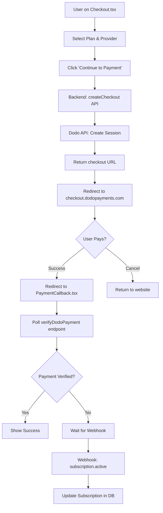
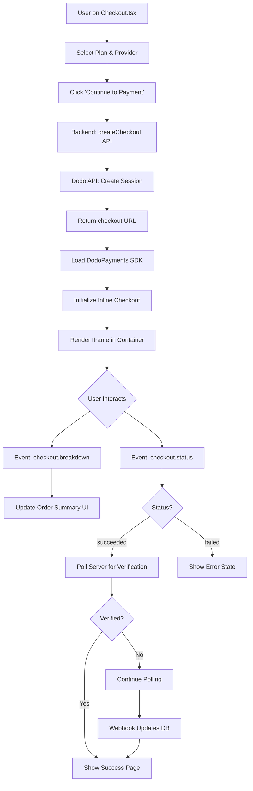

# Dodo Payments Inline Checkout Integration Plan

> **Objective**: Migrate from redirect-based Dodo Payments checkout to a fully embedded inline checkout experience for a seamless, professional payment flow within the Durrah Exams website.

---

## Table of Contents

1. [Executive Summary](#executive-summary)
2. [Current State Analysis](#current-state-analysis)
3. [Target Architecture](#target-architecture)
4. [Implementation Plan](#implementation-plan)
5. [Design & UX Specifications](#design--ux-specifications)
6. [Technical Implementation](#technical-implementation)
7. [Testing Strategy](#testing-strategy)
8. [Deployment Plan](#deployment-plan)
9. [Rollback Strategy](#rollback-strategy)
10. [Timeline & Milestones](#timeline--milestones)

---

## Executive Summary

### Current Implementation
- Dodo Payments is integrated via redirect-based checkout
- Users are redirected to `checkout.dodopayments.com` for payment
- Callback handling via `PaymentCallback.tsx` with polling verification
- Comprehensive webhook integration for subscription lifecycle management

### Proposed Solution
- **Inline checkout** embedded directly in the Durrah Exams website
- Seamless, branded payment experience without leaving the site
- Real-time price breakdown and tax calculation display
- Enhanced UX with custom order summary and payment information
- Maintains all existing backend integration (webhooks, subscriptions, portal)

### Key Benefits
✅ **Professional appearance** - Payment flow matches website branding
✅ **Increased conversion** - No redirect friction, reduces drop-off
✅ **Real-time feedback** - Live tax calculation and price updates
✅ **Better mobile UX** - Optimized for mobile without redirect issues
✅ **PCI compliance** - Dodo's secure iframe handles sensitive data
✅ **Maintains existing logic** - Backend integration remains unchanged

---

## Current State Analysis

### Frontend Files
```
frontend/src/pages/Checkout.tsx (890 lines)
├── Payment provider selection (Dodo, PaySky, Kashier)
├── Plan selection (Basic/Pro)
├── Billing cycle toggle (Monthly/Yearly)
├── Coupon application
└── Creates checkout session → Redirects to Dodo

frontend/src/pages/PaymentCallback.tsx (364 lines)
├── Handles return from Dodo checkout
├── Polling verification (10 attempts, 2s interval)
├── Direct verification via verifyDodoPayment endpoint
└── Success/failure display with auto-redirect

frontend/src/lib/dodoPortal.ts (37 lines)
└── Opens Dodo customer portal for subscription management
```

### Backend Files
```
frontend/convex/dodoPayments.ts (989 lines)
├── createCheckout() - Creates Dodo checkout session
├── updateSubscription() - Lifecycle management
├── recordPayment() - Payment recording
├── verifyPayment() - Direct verification
├── createPortal() - Portal session creation
└── reconcileSubscriptionsFromDodo() - Cron sync

frontend/convex/http.ts (819 lines)
├── POST /createDodoPayment
├── POST /dodoWebhook (subscription events)
├── POST /dodoPortalSession
├── POST /verifyDodoPayment
└── POST /syncDodoSubscription
```

### Current Flow Diagram


### Pain Points with Current Implementation
1. ❌ **Redirect friction** - Users leave the site, increasing abandonment
2. ❌ **Inconsistent branding** - Dodo checkout doesn't match site design
3. ❌ **Mobile issues** - Redirects can cause app/browser context loss
4. ❌ **No real-time feedback** - Can't show live tax calculations
5. ❌ **Recovery complexity** - Callback handling requires polling logic

---

## Target Architecture

### Inline Checkout Flow


### Component Hierarchy
```
CheckoutPage (New)
├── OrderSummary (Left/Top - Custom UI)
│   ├── Plan Details
│   ├── Billing Cycle
│   ├── Subtotal (from checkout.breakdown)
│   ├── Tax (from checkout.breakdown)
│   ├── Discount (from checkout.breakdown)
│   └── Total (from checkout.breakdown)
│
└── DodoInlineCheckout (Right/Bottom)
    ├── <div id="dodo-inline-checkout" />
    ├── SDK Initialization
    ├── Event Handlers
    │   ├── checkout.breakdown → Update OrderSummary
    │   ├── checkout.status → Handle completion
    │   ├── checkout.error → Show error
    │   └── checkout.redirect_requested → Handle 3DS
    └── Polling Logic (after completion)
```

### SDK Integration Points
```typescript
// 1. Install SDK
npm install dodopayments-checkout

// 2. Initialize
DodoPayments.Initialize({
  mode: "test", // or "live"
  displayType: "inline",
  onEvent: (event) => {
    // Handle real-time events
  }
});

// 3. Open checkout
DodoPayments.Checkout.open({
  checkoutUrl: checkoutSessionUrl,
  elementId: "dodo-inline-checkout",
  options: {
    showTimer: true,
    showSecurityBadge: true,
    manualRedirect: true, // We handle redirects
    themeConfig: {
      // Custom branding
    }
  }
});
```

---

## Implementation Plan

### Phase 1: Preparation & Setup (Day 1)

#### 1.1 Install Dependencies
```bash
cd frontend
npm install dodopayments-checkout
```

#### 1.2 Create New Components Structure
```
frontend/src/pages/
├── CheckoutInline.tsx (NEW - Main inline checkout page)
└── CheckoutLegacy.tsx (RENAME - Keep old version as fallback)

frontend/src/components/checkout/
├── DodoInlineCheckout.tsx (NEW - Dodo iframe wrapper)
├── OrderSummary.tsx (NEW - Custom order details)
├── PlanSelector.tsx (NEW - Extracted from old Checkout.tsx)
├── BillingCycleToggle.tsx (NEW - Extracted)
└── CouponInput.tsx (NEW - Extracted)
```

#### 1.3 Environment Variable Validation
Ensure these are set:
```env
# .env.local (frontend)
VITE_CONVEX_URL=https://...
VITE_DODO_MODE=test  # or "live" for production
```

### Phase 2: Component Development (Days 2-3)

#### 2.1 Create `OrderSummary.tsx`
**Purpose**: Display plan details, pricing breakdown, and totals

**Features**:
- Plan name and description
- Billing cycle (Monthly/Yearly)
- Subtotal display
- Tax calculation (from `checkout.breakdown` event)
- Discount display (if coupon applied)
- Grand total
- Responsive design (mobile-first)

**Props**:
```typescript
interface OrderSummaryProps {
  plan: 'basic' | 'pro';
  billingCycle: 'monthly' | 'yearly';
  breakdown: CheckoutBreakdownData | null;
  couponCode?: string;
}
```

#### 2.2 Create `DodoInlineCheckout.tsx`
**Purpose**: Wrapper for Dodo SDK initialization and event handling

**Features**:
- SDK initialization with error handling
- Event listener setup
- Checkout iframe rendering
- Loading state management
- Error state display
- Cleanup on unmount

**Props**:
```typescript
interface DodoInlineCheckoutProps {
  checkoutUrl: string;
  onBreakdownUpdate: (breakdown: CheckoutBreakdownData) => void;
  onPaymentComplete: (status: 'succeeded' | 'failed' | 'processing') => void;
  onError: (error: string) => void;
  mode: 'test' | 'live';
  themeConfig?: ThemeConfig;
}
```

**Key Methods**:
```typescript
// Initialize SDK
useEffect(() => {
  DodoPayments.Initialize({
    mode,
    displayType: 'inline',
    onEvent: handleEvent
  });

  return () => {
    DodoPayments.Checkout.close();
  };
}, []);

// Open checkout
useEffect(() => {
  if (checkoutUrl) {
    DodoPayments.Checkout.open({
      checkoutUrl,
      elementId: 'dodo-inline-checkout',
      options: {
        showTimer: true,
        showSecurityBadge: true,
        manualRedirect: true,
        themeConfig
      }
    });
  }
}, [checkoutUrl]);
```

#### 2.3 Create `CheckoutInline.tsx` (Main Page)
**Purpose**: Orchestrate the entire checkout experience

**Layout**:
```tsx
<div className="checkout-container">
  {/* Desktop: Side-by-side | Mobile: Stacked */}
  <div className="checkout-grid">

    {/* Left/Top - Order Summary */}
    <div className="order-summary-section">
      <PlanSelector
        selectedPlan={plan}
        onPlanChange={setPlan}
      />
      <BillingCycleToggle
        cycle={billingCycle}
        onCycleChange={setBillingCycle}
      />
      <CouponInput
        onApplyCoupon={handleCouponApply}
      />
      <OrderSummary
        plan={plan}
        billingCycle={billingCycle}
        breakdown={breakdown}
        couponCode={appliedCoupon}
      />
    </div>

    {/* Right/Bottom - Dodo Inline Checkout */}
    <div className="checkout-iframe-section">
      {loading && <CheckoutSkeleton />}
      {error && <ErrorDisplay error={error} />}
      <DodoInlineCheckout
        checkoutUrl={checkoutUrl}
        onBreakdownUpdate={setBreakdown}
        onPaymentComplete={handlePaymentComplete}
        onError={setError}
        mode={isDev ? 'test' : 'live'}
        themeConfig={DURRAH_THEME}
      />
    </div>

  </div>
</div>
```

**State Management**:
```typescript
const [plan, setPlan] = useState<'basic' | 'pro'>('basic');
const [billingCycle, setBillingCycle] = useState<'monthly' | 'yearly'>('monthly');
const [checkoutUrl, setCheckoutUrl] = useState<string>('');
const [breakdown, setBreakdown] = useState<CheckoutBreakdownData | null>(null);
const [loading, setLoading] = useState(true);
const [error, setError] = useState<string | null>(null);
const [paymentStatus, setPaymentStatus] = useState<'idle' | 'processing' | 'verifying'>('idle');
```

**Flow**:
1. User selects plan/cycle
2. Create checkout session via `createDodoPayment` endpoint
3. Initialize inline checkout with returned URL
4. Listen for `checkout.breakdown` events → Update OrderSummary
5. Listen for `checkout.status` events → Start verification polling
6. Poll `verifyDodoPayment` endpoint until confirmed
7. Show success page or redirect

### Phase 3: Styling & Theming (Day 3)

#### 3.1 Define Brand Theme
```typescript
// frontend/src/config/dodoTheme.ts
export const DURRAH_THEME: ThemeConfig = {
  light: {
    bgPrimary: "#FFFFFF",
    bgSecondary: "#F9FAFB",
    borderPrimary: "#E5E7EB",
    borderSecondary: "#9CA3AF",
    inputFocusBorder: "#3B82F6",
    textPrimary: "#111827",
    textSecondary: "#6B7280",
    textPlaceholder: "#9CA3AF",
    textError: "#DC2626",
    textSuccess: "#059669",
    buttonPrimary: "#3B82F6",      // Primary blue
    buttonPrimaryHover: "#2563EB",
    buttonTextPrimary: "#FFFFFF",
    buttonSecondary: "#F3F4F6",
    buttonSecondaryHover: "#E5E7EB",
    buttonTextSecondary: "#374151",
  },
  dark: {
    bgPrimary: "#0D0D0D",          // As recommended by Dodo
    bgSecondary: "#1A1A1A",
    borderPrimary: "#323232",
    borderSecondary: "#707070",
    inputFocusBorder: "#3B82F6",
    textPrimary: "#F9FAFB",
    textSecondary: "#9CA3AF",
    textPlaceholder: "#6B7280",
    textError: "#F87171",
    textSuccess: "#34D399",
    buttonPrimary: "#3B82F6",
    buttonPrimaryHover: "#2563EB",
    buttonTextPrimary: "#FFFFFF",
    buttonSecondary: "#2A2A2A",
    buttonSecondaryHover: "#3A3A3A",
    buttonTextSecondary: "#F9FAFB",
  },
  radius: "8px",
};
```

#### 3.2 Responsive Layout
```css
/* Mobile First */
.checkout-grid {
  display: flex;
  flex-direction: column;
  gap: 2rem;
}

/* Tablet & Desktop */
@media (min-width: 768px) {
  .checkout-grid {
    display: grid;
    grid-template-columns: 1fr 1fr;
    gap: 3rem;
  }
}

/* Large Desktop */
@media (min-width: 1280px) {
  .checkout-grid {
    grid-template-columns: 2fr 3fr;
    max-width: 1400px;
    margin: 0 auto;
  }
}
```

#### 3.3 Loading States
```tsx
{/* Skeleton while checkout loads */}
<div className="checkout-skeleton">
  <div className="skeleton-header" />
  <div className="skeleton-form">
    <div className="skeleton-input" />
    <div className="skeleton-input" />
    <div className="skeleton-input" />
  </div>
  <div className="skeleton-button" />
</div>
```

### Phase 4: Event Handling & Verification (Day 4)

#### 4.1 Breakdown Event Handler
```typescript
const handleBreakdownUpdate = (breakdown: CheckoutBreakdownData) => {
  setBreakdown(breakdown);

  // Optional: Analytics tracking
  trackEvent('checkout_breakdown_updated', {
    subtotal: breakdown.subTotal,
    tax: breakdown.tax,
    total: breakdown.finalTotal || breakdown.total,
    currency: breakdown.finalTotalCurrency || breakdown.currency
  });
};
```

#### 4.2 Payment Completion Handler
```typescript
const handlePaymentComplete = async (status: 'succeeded' | 'failed' | 'processing') => {
  if (status === 'failed') {
    setError('Payment failed. Please try again.');
    return;
  }

  if (status === 'succeeded') {
    setPaymentStatus('verifying');
    await startPaymentVerification();
  }
};

const startPaymentVerification = async () => {
  const maxAttempts = 15;
  let attempts = 0;

  const pollInterval = setInterval(async () => {
    attempts++;

    try {
      const response = await fetch(`${convexUrl}/verifyDodoPayment`, {
        method: 'POST',
        headers: { 'Content-Type': 'application/json' },
        body: JSON.stringify({
          userId: user.id,
          // Add any tracking IDs if available
        })
      });

      const result = await response.json();

      if (result.status === 'active' || result.status === 'trialing') {
        clearInterval(pollInterval);
        setPaymentStatus('idle');
        // Redirect to success page
        router.push('/payment-success');
      } else if (attempts >= maxAttempts) {
        clearInterval(pollInterval);
        setPaymentStatus('idle');
        // Show "verification taking longer than expected" message
        showDelayedVerificationMessage();
      }
    } catch (error) {
      console.error('Verification polling error:', error);
      if (attempts >= maxAttempts) {
        clearInterval(pollInterval);
        setPaymentStatus('idle');
        setError('Payment verification failed. Please contact support.');
      }
    }
  }, 2000); // Poll every 2 seconds
};
```

#### 4.3 Redirect Handler (3DS, Google Pay, etc.)
```typescript
const handleRedirectRequested = (redirectUrl: string) => {
  // Save payment state before redirect
  sessionStorage.setItem('pendingPaymentId', checkoutSessionId);
  sessionStorage.setItem('paymentReturnUrl', window.location.href);

  // Redirect for authentication
  window.location.href = redirectUrl;
};

// On component mount, check for return from redirect
useEffect(() => {
  const pendingPaymentId = sessionStorage.getItem('pendingPaymentId');

  if (pendingPaymentId) {
    // User returned from payment authentication
    sessionStorage.removeItem('pendingPaymentId');
    sessionStorage.removeItem('paymentReturnUrl');

    setPaymentStatus('verifying');
    startPaymentVerification();
  }
}, []);
```

#### 4.4 Error Event Handler
```typescript
const handleError = (errorMessage: string) => {
  console.error('Dodo checkout error:', errorMessage);
  setError(errorMessage);

  // Track error for debugging
  trackEvent('checkout_error', {
    error: errorMessage,
    plan,
    billingCycle
  });
};
```

### Phase 5: Backend Adjustments (Day 4)

#### 5.1 Update `createCheckout` Function
No changes needed! The existing `createCheckout` function in `dodoPayments.ts` already returns a checkout session URL that works for both redirect and inline modes.

However, optionally add success/cancel URLs that work with inline mode:

```typescript
// In dodoPayments.ts - createCheckout function
const checkoutData = {
  items: [
    {
      productId: productId,
      quantity: 1,
    },
  ],
  customer: {
    email: userEmail,
    ...(customerId ? { id: customerId } : {}),
  },
  // For inline mode, these URLs are used for redirect_requested events
  successUrl: `${process.env.VITE_APP_URL}/checkout-inline?status=success`,
  cancelUrl: `${process.env.VITE_APP_URL}/checkout-inline?status=cancelled`,
  metadata: {
    userId: userId,
    email: userEmail,
    plan: productId,
  },
};
```

#### 5.2 Maintain Existing Webhook Logic
**No changes required!** The webhook handler in `http.ts` and subscription logic in `dodoPayments.ts` work identically for inline checkout.

The flow remains:
1. Payment completes in inline checkout
2. Dodo sends webhook to `/dodoWebhook`
3. Webhook updates subscription status in Supabase
4. Frontend polling picks up the status change

### Phase 6: Testing & Validation (Day 5)

#### 6.1 Unit Testing
```typescript
// __tests__/DodoInlineCheckout.test.tsx
describe('DodoInlineCheckout', () => {
  it('initializes SDK with correct mode', () => { });
  it('handles breakdown events correctly', () => { });
  it('handles payment completion', () => { });
  it('handles errors gracefully', () => { });
  it('cleans up on unmount', () => { });
});

// __tests__/CheckoutInline.test.tsx
describe('CheckoutInline', () => {
  it('creates checkout session on mount', () => { });
  it('updates order summary on breakdown', () => { });
  it('starts verification polling on success', () => { });
  it('handles redirect requests', () => { });
});
```

#### 6.2 Integration Testing Checklist
- [ ] Checkout session creation
- [ ] Inline iframe renders correctly
- [ ] Order summary updates in real-time
- [ ] Tax calculation displays correctly
- [ ] Payment completion triggers verification
- [ ] Webhook updates subscription status
- [ ] Polling detects status change
- [ ] Success page displays correctly
- [ ] Error states display correctly
- [ ] Mobile responsive layout works
- [ ] Dark mode theme applies correctly
- [ ] 3DS redirect flow works
- [ ] Google Pay integration works (if enabled)
- [ ] Apple Pay integration works (if enabled)

#### 6.3 Test Card Numbers (Test Mode)
```
Success: 4242 4242 4242 4242
3DS Required: 4000 0027 6000 3184
Decline: 4000 0000 0000 0002
Insufficient Funds: 4000 0000 0000 9995
```

---

## Design & UX Specifications

### Layout Examples

#### Desktop Layout
```
┌─────────────────────────────────────────────────────────────┐
│                        Durrah Exams                          │
├─────────────────────────────────────────────────────────────┤
│                                                               │
│  ┌──────────────────┐  ┌──────────────────────────────────┐ │
│  │  Order Summary   │  │   Dodo Inline Checkout           │ │
│  │                  │  │                                  │ │
│  │  Plan: Pro       │  │  ┌────────────────────────────┐ │ │
│  │  Cycle: Yearly   │  │  │  Email: _______________    │ │ │
│  │                  │  │  │  Country: ▼ United States  │ │ │
│  │  Subtotal: $50   │  │  │  ZIP: _______________      │ │ │
│  │  Tax: $4.50      │  │  └────────────────────────────┘ │ │
│  │  Discount: -$5   │  │                                  │ │
│  │  ─────────────   │  │  Payment Method:                 │ │
│  │  Total: $49.50   │  │  ○ Card  ○ PayPal  ○ Apple Pay  │ │
│  │                  │  │                                  │ │
│  │  [Coupon: ____]  │  │  Card Details:                   │ │
│  │                  │  │  ┌────────────────────────────┐ │ │
│  │                  │  │  │  Card Number: ____________ │ │ │
│  │  Secure checkout │  │  │  Exp: ____  CVC: ____     │ │ │
│  │  powered by Dodo │  │  └────────────────────────────┘ │ │
│  │  Payments        │  │                                  │ │
│  └──────────────────┘  │  [Pay $49.50]                    │ │
│                         │                                  │ │
│                         │  Powered by Dodo Payments        │ │
│                         └──────────────────────────────────┘ │
│                                                               │
└─────────────────────────────────────────────────────────────┘
```

#### Mobile Layout (Stacked)
```
┌──────────────────────┐
│    Durrah Exams      │
├──────────────────────┤
│  Order Summary       │
│                      │
│  Plan: Pro           │
│  Cycle: Yearly       │
│                      │
│  Subtotal: $50       │
│  Tax: $4.50          │
│  ─────────────       │
│  Total: $54.50       │
│                      │
│  [Coupon: ________]  │
└──────────────────────┘
┌──────────────────────┐
│  Dodo Checkout       │
│                      │
│  Email: ___________  │
│  Country: ▼ US       │
│  ZIP: ___________    │
│                      │
│  Payment Method:     │
│  ○ Card  ○ PayPal    │
│                      │
│  Card Details:       │
│  ┌────────────────┐  │
│  │  4242 4242 ... │  │
│  │  12/25  123    │  │
│  └────────────────┘  │
│                      │
│  [Pay $54.50]        │
│                      │
│  Powered by Dodo     │
└──────────────────────┘
```

### Color Palette
```css
/* Primary Colors */
--primary-blue: #3B82F6;
--primary-blue-hover: #2563EB;
--primary-blue-light: #DBEAFE;

/* Neutrals */
--gray-50: #F9FAFB;
--gray-100: #F3F4F6;
--gray-200: #E5E7EB;
--gray-300: #D1D5DB;
--gray-600: #4B5563;
--gray-700: #374151;
--gray-900: #111827;

/* Semantic Colors */
--success: #059669;
--success-light: #D1FAE5;
--error: #DC2626;
--error-light: #FEE2E2;
--warning: #F59E0B;
--warning-light: #FEF3C7;

/* Dark Mode */
--dark-bg: #0D0D0D;
--dark-bg-secondary: #1A1A1A;
--dark-border: #323232;
--dark-text: #F9FAFB;
```

### Typography
```css
/* Font Family */
font-family: 'Inter', -apple-system, BlinkMacSystemFont, 'Segoe UI', sans-serif;

/* Font Sizes */
--text-xs: 0.75rem;   /* 12px */
--text-sm: 0.875rem;  /* 14px */
--text-base: 1rem;    /* 16px */
--text-lg: 1.125rem;  /* 18px */
--text-xl: 1.25rem;   /* 20px */
--text-2xl: 1.5rem;   /* 24px */
--text-3xl: 1.875rem; /* 30px */

/* Font Weights */
--font-normal: 400;
--font-medium: 500;
--font-semibold: 600;
--font-bold: 700;

/* Usage */
.heading-1 { font-size: var(--text-3xl); font-weight: var(--font-bold); }
.heading-2 { font-size: var(--text-2xl); font-weight: var(--font-semibold); }
.body { font-size: var(--text-base); font-weight: var(--font-normal); }
.label { font-size: var(--text-sm); font-weight: var(--font-medium); }
.caption { font-size: var(--text-xs); font-weight: var(--font-normal); }
```

### Spacing System
```css
--space-1: 0.25rem;  /* 4px */
--space-2: 0.5rem;   /* 8px */
--space-3: 0.75rem;  /* 12px */
--space-4: 1rem;     /* 16px */
--space-5: 1.25rem;  /* 20px */
--space-6: 1.5rem;   /* 24px */
--space-8: 2rem;     /* 32px */
--space-10: 2.5rem;  /* 40px */
--space-12: 3rem;    /* 48px */
```

### Component Styling Guidelines

#### Order Summary Card
```css
.order-summary {
  background: var(--gray-50);
  border: 1px solid var(--gray-200);
  border-radius: 8px;
  padding: var(--space-6);
  box-shadow: 0 1px 3px rgba(0, 0, 0, 0.1);
}

.order-summary-item {
  display: flex;
  justify-content: space-between;
  padding: var(--space-3) 0;
  border-bottom: 1px solid var(--gray-200);
}

.order-summary-total {
  font-size: var(--text-xl);
  font-weight: var(--font-bold);
  color: var(--gray-900);
  padding-top: var(--space-4);
}
```

#### Checkout Container
```css
.checkout-iframe-section {
  background: white;
  border-radius: 8px;
  padding: var(--space-8);
  box-shadow: 0 4px 6px rgba(0, 0, 0, 0.1);
}

#dodo-inline-checkout {
  min-height: 600px;
  width: 100%;
}
```

---

## Technical Implementation

### File Structure
```
frontend/src/
├── pages/
│   ├── CheckoutInline.tsx ✨ NEW
│   └── CheckoutLegacy.tsx (renamed from Checkout.tsx)
│
├── components/
│   └── checkout/
│       ├── DodoInlineCheckout.tsx ✨ NEW
│       ├── OrderSummary.tsx ✨ NEW
│       ├── PlanSelector.tsx ✨ NEW
│       ├── BillingCycleToggle.tsx ✨ NEW
│       ├── CouponInput.tsx ✨ NEW
│       ├── CheckoutSkeleton.tsx ✨ NEW
│       └── PaymentStatusModal.tsx ✨ NEW
│
├── lib/
│   ├── dodoPortal.ts (existing)
│   └── dodoInline.ts ✨ NEW (helper functions)
│
├── hooks/
│   ├── useDodoCheckout.ts ✨ NEW
│   └── usePaymentVerification.ts ✨ NEW
│
├── config/
│   └── dodoTheme.ts ✨ NEW
│
└── types/
    └── dodo.ts ✨ NEW (TypeScript types)
```

### Key Code Snippets

#### `useDodoCheckout.ts` Hook
```typescript
import { useEffect, useState } from 'react';
import { DodoPayments, CheckoutEvent, CheckoutBreakdownData } from 'dodopayments-checkout';

interface UseDodoCheckoutProps {
  mode: 'test' | 'live';
  checkoutUrl: string;
  elementId: string;
  onBreakdownUpdate?: (breakdown: CheckoutBreakdownData) => void;
  onStatusUpdate?: (status: string) => void;
  onError?: (error: string) => void;
  themeConfig?: any;
}

export const useDodoCheckout = ({
  mode,
  checkoutUrl,
  elementId,
  onBreakdownUpdate,
  onStatusUpdate,
  onError,
  themeConfig
}: UseDodoCheckoutProps) => {
  const [isReady, setIsReady] = useState(false);
  const [breakdown, setBreakdown] = useState<CheckoutBreakdownData | null>(null);

  useEffect(() => {
    // Initialize SDK
    try {
      DodoPayments.Initialize({
        mode,
        displayType: 'inline',
        onEvent: (event: CheckoutEvent) => {
          console.log('Dodo event:', event);

          switch (event.event_type) {
            case 'checkout.form_ready':
              setIsReady(true);
              break;

            case 'checkout.breakdown':
              const breakdownData = event.data?.message as CheckoutBreakdownData;
              setBreakdown(breakdownData);
              onBreakdownUpdate?.(breakdownData);
              break;

            case 'checkout.status':
              const status = event.data?.message?.status;
              onStatusUpdate?.(status);
              break;

            case 'checkout.error':
              const errorMsg = event.data?.message || 'An error occurred';
              onError?.(errorMsg);
              break;

            case 'checkout.redirect_requested':
              const redirectUrl = event.data?.message?.redirect_to;
              if (redirectUrl) {
                sessionStorage.setItem('pendingCheckout', checkoutUrl);
                window.location.href = redirectUrl;
              }
              break;
          }
        }
      });
    } catch (error) {
      console.error('Failed to initialize Dodo SDK:', error);
      onError?.('Failed to initialize checkout');
    }

    return () => {
      DodoPayments.Checkout.close();
    };
  }, [mode]);

  useEffect(() => {
    if (checkoutUrl && elementId) {
      try {
        DodoPayments.Checkout.open({
          checkoutUrl,
          elementId,
          options: {
            showTimer: true,
            showSecurityBadge: true,
            manualRedirect: true,
            themeConfig
          }
        });
      } catch (error) {
        console.error('Failed to open checkout:', error);
        onError?.('Failed to open checkout');
      }
    }
  }, [checkoutUrl, elementId, themeConfig]);

  return { isReady, breakdown };
};
```

#### `usePaymentVerification.ts` Hook
```typescript
import { useEffect, useState } from 'react';
import { useConvex } from 'convex/react';
import { api } from '../../convex/_generated/api';

interface UsePaymentVerificationProps {
  userId: string;
  shouldVerify: boolean;
  onSuccess: () => void;
  onFailed: () => void;
}

export const usePaymentVerification = ({
  userId,
  shouldVerify,
  onSuccess,
  onFailed
}: UsePaymentVerificationProps) => {
  const [isVerifying, setIsVerifying] = useState(false);
  const [attempts, setAttempts] = useState(0);
  const convex = useConvex();

  useEffect(() => {
    if (!shouldVerify) return;

    setIsVerifying(true);
    const maxAttempts = 15; // 30 seconds total (2s * 15)

    const pollInterval = setInterval(async () => {
      try {
        // Call your existing verifyDodoPayment endpoint
        const response = await fetch(`${import.meta.env.VITE_CONVEX_URL}/verifyDodoPayment`, {
          method: 'POST',
          headers: { 'Content-Type': 'application/json' },
          body: JSON.stringify({ userId })
        });

        const result = await response.json();

        if (result.status === 'active' || result.status === 'trialing') {
          clearInterval(pollInterval);
          setIsVerifying(false);
          onSuccess();
        } else if (result.status === 'payment_failed') {
          clearInterval(pollInterval);
          setIsVerifying(false);
          onFailed();
        }

        setAttempts(prev => {
          const newAttempts = prev + 1;
          if (newAttempts >= maxAttempts) {
            clearInterval(pollInterval);
            setIsVerifying(false);
            // Fallback to webhook-based verification
            console.log('Polling timeout - waiting for webhook');
          }
          return newAttempts;
        });

      } catch (error) {
        console.error('Verification polling error:', error);
      }
    }, 2000);

    return () => {
      clearInterval(pollInterval);
    };
  }, [shouldVerify, userId]);

  return { isVerifying, attempts };
};
```

#### `DodoInlineCheckout.tsx` Component
```typescript
import React from 'react';
import { useDodoCheckout } from '../../hooks/useDodoCheckout';
import { CheckoutBreakdownData } from 'dodopayments-checkout';
import { DURRAH_THEME } from '../../config/dodoTheme';

interface DodoInlineCheckoutProps {
  checkoutUrl: string;
  mode: 'test' | 'live';
  onBreakdownUpdate: (breakdown: CheckoutBreakdownData) => void;
  onStatusUpdate: (status: string) => void;
  onError: (error: string) => void;
}

export const DodoInlineCheckout: React.FC<DodoInlineCheckoutProps> = ({
  checkoutUrl,
  mode,
  onBreakdownUpdate,
  onStatusUpdate,
  onError
}) => {
  const { isReady, breakdown } = useDodoCheckout({
    mode,
    checkoutUrl,
    elementId: 'dodo-inline-checkout',
    onBreakdownUpdate,
    onStatusUpdate,
    onError,
    themeConfig: DURRAH_THEME
  });

  return (
    <div className="dodo-checkout-container">
      {!isReady && (
        <div className="checkout-loading">
          <div className="spinner" />
          <p>Loading secure checkout...</p>
        </div>
      )}
      <div
        id="dodo-inline-checkout"
        className={!isReady ? 'hidden' : ''}
      />
    </div>
  );
};
```

#### `OrderSummary.tsx` Component
```typescript
import React from 'react';
import { CheckoutBreakdownData } from 'dodopayments-checkout';

interface OrderSummaryProps {
  plan: 'basic' | 'pro';
  billingCycle: 'monthly' | 'yearly';
  breakdown: CheckoutBreakdownData | null;
  couponCode?: string;
}

export const OrderSummary: React.FC<OrderSummaryProps> = ({
  plan,
  billingCycle,
  breakdown,
  couponCode
}) => {
  const formatAmount = (amount: number | null | undefined, currency: string = 'USD') => {
    if (amount == null) return '—';
    return new Intl.NumberFormat('en-US', {
      style: 'currency',
      currency: currency,
    }).format(amount / 100);
  };

  const currency = breakdown?.finalTotalCurrency || breakdown?.currency || 'USD';
  const planName = plan === 'pro' ? 'Pro Plan' : 'Basic Plan';
  const cycleText = billingCycle === 'yearly' ? 'Yearly' : 'Monthly';

  return (
    <div className="order-summary">
      <h2 className="heading-2">Order Summary</h2>

      <div className="plan-info">
        <h3 className="heading-3">{planName}</h3>
        <p className="text-secondary">Billed {cycleText}</p>
      </div>

      <div className="summary-items">
        {breakdown?.subTotal != null && (
          <div className="summary-item">
            <span>Subtotal</span>
            <span>{formatAmount(breakdown.subTotal, currency)}</span>
          </div>
        )}

        {breakdown?.discount != null && breakdown.discount > 0 && (
          <div className="summary-item discount">
            <span>Discount {couponCode && `(${couponCode})`}</span>
            <span className="text-success">-{formatAmount(breakdown.discount, currency)}</span>
          </div>
        )}

        {breakdown?.tax != null && (
          <div className="summary-item">
            <span>Tax</span>
            <span>{formatAmount(breakdown.tax, currency)}</span>
          </div>
        )}

        <div className="summary-divider" />

        <div className="summary-total">
          <span className="total-label">Total</span>
          <span className="total-amount">
            {formatAmount(
              breakdown?.finalTotal || breakdown?.total,
              currency
            )}
          </span>
        </div>
      </div>

      <div className="security-badge">
        <svg className="lock-icon" fill="currentColor" viewBox="0 0 20 20">
          <path fillRule="evenodd" d="M5 9V7a5 5 0 0110 0v2a2 2 0 012 2v5a2 2 0 01-2 2H5a2 2 0 01-2-2v-5a2 2 0 012-2zm8-2v2H7V7a3 3 0 016 0z" clipRule="evenodd" />
        </svg>
        <span>Secure checkout powered by Dodo Payments</span>
      </div>
    </div>
  );
};
```

#### `CheckoutInline.tsx` Main Page
```typescript
import React, { useEffect, useState } from 'react';
import { useNavigate } from 'react-router-dom';
import { useAuth } from '../contexts/AuthContext';
import { DodoInlineCheckout } from '../components/checkout/DodoInlineCheckout';
import { OrderSummary } from '../components/checkout/OrderSummary';
import { PlanSelector } from '../components/checkout/PlanSelector';
import { BillingCycleToggle } from '../components/checkout/BillingCycleToggle';
import { usePaymentVerification } from '../hooks/usePaymentVerification';
import { CheckoutBreakdownData } from 'dodopayments-checkout';

export const CheckoutInline: React.FC = () => {
  const { user } = useAuth();
  const navigate = useNavigate();

  const [plan, setPlan] = useState<'basic' | 'pro'>('basic');
  const [billingCycle, setBillingCycle] = useState<'monthly' | 'yearly'>('monthly');
  const [checkoutUrl, setCheckoutUrl] = useState<string>('');
  const [breakdown, setBreakdown] = useState<CheckoutBreakdownData | null>(null);
  const [loading, setLoading] = useState(false);
  const [error, setError] = useState<string | null>(null);
  const [shouldVerify, setShouldVerify] = useState(false);

  const mode = import.meta.env.VITE_DODO_MODE || 'test';

  // Product IDs from your existing code
  const PRODUCT_IDS = {
    monthly: 'pdt_0NVdvPLWrAr1Rym66kXLP',
    yearly: 'pdt_0NVdw6iZw42sQIdxctP55'
  };

  useEffect(() => {
    if (!user) {
      navigate('/login?redirect=/checkout-inline');
      return;
    }
    createCheckoutSession();
  }, [user, plan, billingCycle]);

  const createCheckoutSession = async () => {
    setLoading(true);
    setError(null);

    try {
      const productId = PRODUCT_IDS[billingCycle];

      const response = await fetch(`${import.meta.env.VITE_CONVEX_URL}/createDodoPayment`, {
        method: 'POST',
        headers: { 'Content-Type': 'application/json' },
        body: JSON.stringify({
          userId: user.id,
          plan: plan,
          billingCycle: billingCycle,
          productId: productId
        })
      });

      const result = await response.json();

      if (result.checkoutUrl) {
        setCheckoutUrl(result.checkoutUrl);
      } else {
        throw new Error('Failed to create checkout session');
      }
    } catch (err) {
      console.error('Checkout creation error:', err);
      setError('Failed to create checkout session. Please try again.');
    } finally {
      setLoading(false);
    }
  };

  const handleBreakdownUpdate = (newBreakdown: CheckoutBreakdownData) => {
    setBreakdown(newBreakdown);
  };

  const handleStatusUpdate = (status: string) => {
    console.log('Payment status:', status);

    if (status === 'succeeded') {
      setShouldVerify(true);
    } else if (status === 'failed') {
      setError('Payment failed. Please try again.');
    }
  };

  const handleCheckoutError = (errorMsg: string) => {
    setError(errorMsg);
  };

  usePaymentVerification({
    userId: user?.id || '',
    shouldVerify,
    onSuccess: () => {
      navigate('/payment-success');
    },
    onFailed: () => {
      setError('Payment failed. Please contact support.');
      setShouldVerify(false);
    }
  });

  if (!user) return null;

  return (
    <div className="checkout-page">
      <div className="checkout-container">
        <div className="checkout-grid">

          {/* Left/Top - Order Summary */}
          <div className="order-summary-section">
            <PlanSelector
              selectedPlan={plan}
              onPlanChange={setPlan}
            />

            <BillingCycleToggle
              cycle={billingCycle}
              onCycleChange={setBillingCycle}
            />

            <OrderSummary
              plan={plan}
              billingCycle={billingCycle}
              breakdown={breakdown}
            />
          </div>

          {/* Right/Bottom - Inline Checkout */}
          <div className="checkout-iframe-section">
            {loading && (
              <div className="checkout-loading">
                <p>Creating checkout session...</p>
              </div>
            )}

            {error && (
              <div className="error-banner">
                <p>{error}</p>
                <button onClick={createCheckoutSession}>Try Again</button>
              </div>
            )}

            {checkoutUrl && !loading && (
              <DodoInlineCheckout
                checkoutUrl={checkoutUrl}
                mode={mode}
                onBreakdownUpdate={handleBreakdownUpdate}
                onStatusUpdate={handleStatusUpdate}
                onError={handleCheckoutError}
              />
            )}

            {shouldVerify && (
              <div className="verifying-overlay">
                <div className="spinner" />
                <p>Verifying payment...</p>
              </div>
            )}
          </div>

        </div>
      </div>
    </div>
  );
};
```

---

## Testing Strategy

### Testing Phases

#### Phase 1: Unit Testing
**Tools**: Jest, React Testing Library

**Test Cases**:
- [ ] `useDodoCheckout` hook initializes SDK correctly
- [ ] `useDodoCheckout` handles events correctly
- [ ] `usePaymentVerification` polls correctly
- [ ] `usePaymentVerification` stops after max attempts
- [ ] `OrderSummary` formats currency correctly
- [ ] `OrderSummary` handles null breakdown gracefully
- [ ] `DodoInlineCheckout` renders loading state
- [ ] `DodoInlineCheckout` renders checkout iframe

#### Phase 2: Integration Testing
**Tools**: Cypress / Playwright

**Test Scenarios**:
```typescript
// Test: Complete successful payment flow
describe('Inline Checkout - Success Flow', () => {
  it('should complete payment successfully', () => {
    cy.visit('/checkout-inline');
    cy.get('[data-testid="plan-selector"]').select('pro');
    cy.get('[data-testid="billing-cycle"]').click(); // Switch to yearly

    // Wait for checkout iframe to load
    cy.get('#dodo-inline-checkout iframe').should('exist');

    // Enter payment details (in iframe - may need to handle cross-origin)
    // Note: Iframe interaction may require Dodo test mode special handling

    // Verify order summary updates
    cy.get('[data-testid="order-total"]').should('contain', '$50');

    // Complete payment
    // ... (iframe interaction)

    // Should redirect to success page
    cy.url().should('include', '/payment-success');
  });
});

// Test: Failed payment handling
describe('Inline Checkout - Failed Payment', () => {
  it('should show error on payment failure', () => {
    // ... similar setup
    // Use test card: 4000 0000 0000 0002
    // Should show error message
    cy.get('[data-testid="error-banner"]').should('be.visible');
  });
});

// Test: 3DS redirect flow
describe('Inline Checkout - 3DS Flow', () => {
  it('should handle 3DS redirect correctly', () => {
    // ... similar setup
    // Use 3DS test card: 4000 0027 6000 3184
    // Should redirect to 3DS page
    // Should return and verify payment
  });
});
```

#### Phase 3: Manual Testing Checklist

**Desktop Testing**:
- [ ] Chrome (latest)
- [ ] Firefox (latest)
- [ ] Safari (latest)
- [ ] Edge (latest)

**Mobile Testing**:
- [ ] iOS Safari
- [ ] Android Chrome
- [ ] iOS Chrome
- [ ] Android Firefox

**Test Scenarios**:
1. **Basic Flow**:
   - [ ] Select plan
   - [ ] Switch billing cycle
   - [ ] See order summary update
   - [ ] Complete payment
   - [ ] Verify success page

2. **Tax Calculation**:
   - [ ] Enter US ZIP code → See tax calculated
   - [ ] Change to different state → See tax update
   - [ ] Enter international address → No tax

3. **Error Handling**:
   - [ ] Use declined card → See error
   - [ ] Use insufficient funds card → See error
   - [ ] Network error during payment → Graceful handling

4. **3DS Flow**:
   - [ ] Use 3DS card → Redirect to bank page
   - [ ] Complete authentication → Return to site
   - [ ] Payment verifies successfully

5. **Digital Wallets** (if enabled):
   - [ ] Apple Pay on Safari → Works
   - [ ] Google Pay on Chrome → Works

6. **Responsive Design**:
   - [ ] Desktop layout (side-by-side) → Correct
   - [ ] Tablet layout → Correct
   - [ ] Mobile layout (stacked) → Correct
   - [ ] Landscape mobile → Correct

7. **Dark Mode**:
   - [ ] Switch to dark mode → Theme applies
   - [ ] Checkout iframe matches → Correct

8. **Edge Cases**:
   - [ ] Slow network → Loading states work
   - [ ] Session expires → Error handling
   - [ ] User closes page during payment → Can return and verify
   - [ ] Multiple tabs open → No conflicts

#### Phase 4: Performance Testing
**Metrics to Track**:
- [ ] Time to first checkout render (< 2 seconds)
- [ ] Breakdown event response time (< 500ms)
- [ ] Payment verification time (< 10 seconds)
- [ ] Page load performance (Lighthouse score > 90)

**Tools**: Lighthouse, WebPageTest

#### Phase 5: Security Testing
**Checks**:
- [ ] No sensitive data logged to console
- [ ] HTTPS enforced on all endpoints
- [ ] Webhook signature validation working
- [ ] CORS headers correctly configured
- [ ] No XSS vulnerabilities
- [ ] No CSRF vulnerabilities

---

## Deployment Plan

### Pre-Deployment Checklist

#### 1. Environment Variables
```bash
# Production .env
VITE_DODO_MODE=live
VITE_CONVEX_URL=https://your-production-convex.cloud
VITE_APP_URL=https://durrahexams.com
DODO_PAYMENTS_API_KEY=prod_sk_xxxxx
```

#### 2. API Key Migration
- [ ] Obtain production Dodo API key
- [ ] Add to environment variables
- [ ] Test with live checkout (small amount)
- [ ] Verify webhook delivery to production

#### 3. Webhook Configuration
- [ ] Endpoint: `https://durrahexams.com/api/dodoWebhook`
- [ ] Events subscribed:
  - [x] `subscription.active`
  - [x] `subscription.renewed`
  - [x] `subscription.cancelled`
  - [x] `subscription.expired`
  - [x] `subscription.failed`
  - [x] `subscription.payment_failed`
  - [x] `payment.succeeded`
- [ ] Test webhook delivery
- [ ] Verify signature validation

#### 4. Domain Verification (for Apple Pay)
If using Apple Pay:
- [ ] Download domain association file
- [ ] Upload to `/.well-known/apple-developer-merchantid-domain-association`
- [ ] Email Dodo support to verify
- [ ] Test Apple Pay on production domain

### Deployment Steps

#### Step 1: Deploy Backend Changes
```bash
# Deploy Convex functions (no changes needed, but redeploy to be safe)
cd frontend
npx convex deploy --prod

# Verify endpoints are accessible
curl -X POST https://your-convex.cloud/createDodoPayment
```

#### Step 2: Build Frontend
```bash
cd frontend
npm run build

# Verify build output
ls -la dist/
```

#### Step 3: Deploy Frontend
```bash
# Example using Vercel
vercel --prod

# Or using your deployment method
# Ensure environment variables are set in deployment platform
```

#### Step 4: Post-Deployment Verification
```bash
# Test checklist
- [ ] Navigate to /checkout-inline
- [ ] Select a plan
- [ ] Complete test payment (use real card for production test)
- [ ] Verify subscription appears in database
- [ ] Check webhook delivery logs
- [ ] Test customer portal access
- [ ] Verify email notifications sent
```

### Deployment Strategy: Blue-Green

#### Option A: Gradual Rollout (Recommended)
```typescript
// In App.tsx or routing file
const useInlineCheckout = () => {
  const rolloutPercentage = 10; // Start with 10% of users
  const userId = useAuth().user?.id;

  if (!userId) return false;

  // Consistent rollout based on user ID hash
  const hash = hashCode(userId);
  return (hash % 100) < rolloutPercentage;
};

// Routing
<Route path="/checkout" element={
  useInlineCheckout() ? <CheckoutInline /> : <CheckoutLegacy />
} />
```

**Rollout Schedule**:
- Day 1: 10% of users → Monitor for 24 hours
- Day 3: 25% of users → Monitor for 24 hours
- Day 5: 50% of users → Monitor for 48 hours
- Day 8: 100% of users → Full rollout

#### Option B: Feature Flag (Advanced)
Use a feature flag service (LaunchDarkly, Split.io, etc.):
```typescript
import { useFeatureFlag } from './featureFlags';

const CheckoutRouter = () => {
  const inlineCheckoutEnabled = useFeatureFlag('inline-checkout');

  return inlineCheckoutEnabled ? <CheckoutInline /> : <CheckoutLegacy />;
};
```

### Monitoring & Alerts

#### Metrics to Track
```typescript
// Track these events
trackEvent('checkout_initiated', { type: 'inline', plan, cycle });
trackEvent('checkout_breakdown_received', { subtotal, tax, total });
trackEvent('checkout_payment_clicked', { amount, currency });
trackEvent('checkout_payment_succeeded', { amount, currency, duration });
trackEvent('checkout_payment_failed', { error, reason });
trackEvent('checkout_verification_polling_started');
trackEvent('checkout_verification_success', { attempts, duration });
```

#### Alert Thresholds
- [ ] Error rate > 5% → Immediate alert
- [ ] Payment success rate < 95% → Warning
- [ ] Average verification time > 15s → Warning
- [ ] Webhook delivery failure > 3 consecutive → Critical alert

#### Dashboard KPIs
```
┌──────────────────────────────────────────┐
│  Inline Checkout Dashboard               │
├──────────────────────────────────────────┤
│  Today's Metrics:                        │
│  • Checkout Sessions: 1,234              │
│  • Completed Payments: 987 (80%)         │
│  • Failed Payments: 45 (3.6%)            │
│  • Avg. Verification Time: 4.2s          │
│  • Webhook Delivery: 99.8%               │
│                                          │
│  Comparison (vs. Legacy):                │
│  • Conversion Rate: +12.3% ↑             │
│  • Drop-off Rate: -23.1% ↓               │
│  • Mobile Conversion: +31.2% ↑           │
│                                          │
│  Issues:                                 │
│  ⚠️ 3 slow verifications (>30s)          │
│  ✅ No critical errors                   │
└──────────────────────────────────────────┘
```

---

## Rollback Strategy

### Rollback Triggers
**Immediate rollback if**:
1. Payment success rate drops below 90%
2. More than 10 critical errors in 1 hour
3. Webhook delivery failure rate > 10%
4. Database corruption detected
5. Security vulnerability discovered

### Rollback Procedure

#### Step 1: Enable Legacy Checkout (Immediate)
```typescript
// In app routing or feature flag
const FORCE_LEGACY_CHECKOUT = true; // Emergency override

<Route path="/checkout" element={
  FORCE_LEGACY_CHECKOUT ? <CheckoutLegacy /> : <CheckoutInline />
} />
```

#### Step 2: Redirect Active Sessions
```typescript
// Add to CheckoutInline.tsx
useEffect(() => {
  if (FORCE_LEGACY_CHECKOUT) {
    // Save state
    sessionStorage.setItem('checkoutState', JSON.stringify({ plan, cycle }));
    // Redirect
    window.location.href = '/checkout-legacy';
  }
}, []);
```

#### Step 3: Verify Rollback
- [ ] All users redirected to legacy checkout
- [ ] Legacy checkout functioning correctly
- [ ] Payment processing working
- [ ] Webhooks still being received
- [ ] No data loss occurred

#### Step 4: Post-Rollback Analysis
```markdown
## Rollback Incident Report

**Date**: YYYY-MM-DD
**Time**: HH:MM UTC
**Trigger**: [Reason for rollback]

**Impact**:
- Users affected: XXX
- Failed payments: XXX
- Revenue impact: $XXX

**Root Cause**:
[Detailed analysis]

**Resolution Timeline**:
- Detection: HH:MM
- Rollback initiated: HH:MM
- Rollback complete: HH:MM
- Total downtime: XX minutes

**Action Items**:
1. [ ] Fix root cause
2. [ ] Add monitoring for similar issues
3. [ ] Update testing procedures
4. [ ] Re-deploy with fixes
```

### Rollback Testing
**Before launch, test rollback**:
```bash
# Simulate rollback scenario
1. Deploy inline checkout to staging
2. Process test payment
3. Enable rollback flag
4. Verify redirect to legacy
5. Complete payment on legacy
6. Confirm no data loss
7. Document rollback time (should be < 5 minutes)
```

---

## Timeline & Milestones

### Week 1: Preparation & Component Development

| Day | Tasks | Owner | Status |
|-----|-------|-------|--------|
| **Mon** | • Install SDK<br>• Create file structure<br>• Set up TypeScript types | Dev | ⬜ |
| **Tue** | • Build `useDodoCheckout` hook<br>• Build `usePaymentVerification` hook<br>• Create theme config | Dev | ⬜ |
| **Wed** | • Build `OrderSummary` component<br>• Build `DodoInlineCheckout` component<br>• Build `CheckoutInline` page | Dev | ⬜ |
| **Thu** | • Implement event handling<br>• Add verification polling<br>• Add error handling | Dev | ⬜ |
| **Fri** | • Styling & responsiveness<br>• Dark mode theming<br>• Loading states | Dev/Design | ⬜ |

### Week 2: Testing & Refinement

| Day | Tasks | Owner | Status |
|-----|-------|-------|--------|
| **Mon** | • Unit testing<br>• Fix bugs | Dev/QA | ⬜ |
| **Tue** | • Integration testing<br>• Cross-browser testing | QA | ⬜ |
| **Wed** | • Mobile testing<br>• Performance optimization | QA/Dev | ⬜ |
| **Thu** | • Security audit<br>• Accessibility review | Security/QA | ⬜ |
| **Fri** | • Staging deployment<br>• Final testing | DevOps | ⬜ |

### Week 3: Deployment & Monitoring

| Day | Tasks | Owner | Status |
|-----|-------|-------|--------|
| **Mon** | • Production deploy (10% rollout)<br>• Monitor metrics | DevOps | ⬜ |
| **Tue** | • Review metrics<br>• Fix any issues | Dev | ⬜ |
| **Wed** | • Increase to 25% rollout<br>• Continue monitoring | DevOps | ⬜ |
| **Thu** | • Increase to 50% rollout | DevOps | ⬜ |
| **Fri** | • Full 100% rollout<br>• Remove legacy code flag | DevOps | ⬜ |

### Week 4: Optimization & Documentation

| Day | Tasks | Owner | Status |
|-----|-------|-------|--------|
| **Mon** | • Performance tuning<br>• User feedback review | Dev | ⬜ |
| **Tue** | • Update documentation<br>• Create runbook | Dev/DevOps | ⬜ |
| **Wed** | • Team training<br>• Support team briefing | All | ⬜ |
| **Thu** | • Final optimization<br>• Analytics review | Dev | ⬜ |
| **Fri** | • Post-launch review<br>• Retrospective | All | ⬜ |

---

## Success Criteria

### Technical Metrics
- [ ] Page load time < 2 seconds
- [ ] Checkout iframe renders in < 1 second
- [ ] Payment verification completes in < 10 seconds (95th percentile)
- [ ] Zero critical bugs in production
- [ ] Webhook success rate > 99%
- [ ] Payment success rate ≥ legacy checkout

### Business Metrics
- [ ] Checkout conversion rate improves by ≥ 5%
- [ ] Mobile conversion rate improves by ≥ 10%
- [ ] Drop-off rate decreases by ≥ 10%
- [ ] Average time to purchase decreases by ≥ 20%
- [ ] Customer support tickets related to checkout decrease by ≥ 30%

### User Experience Metrics
- [ ] User satisfaction score ≥ 4.5/5
- [ ] Zero complaints about "checkout not working"
- [ ] Positive feedback on seamless experience
- [ ] No increase in refund requests

---

## Risk Assessment & Mitigation

### Technical Risks

| Risk | Probability | Impact | Mitigation |
|------|-------------|--------|------------|
| SDK compatibility issues | Medium | High | • Test extensively before launch<br>• Keep legacy checkout as fallback<br>• Monitor browser support |
| Webhook delivery failure | Low | Critical | • Implement polling as backup<br>• Add retry logic<br>• Monitor webhook logs |
| Payment verification timeout | Medium | Medium | • Increase max polling attempts<br>• Add "taking longer than usual" message<br>• Fall back to webhook |
| 3DS redirect breaks flow | Low | High | • Thoroughly test 3DS flow<br>• Store session state before redirect<br>• Add recovery mechanism |
| Performance degradation | Low | Medium | • Load test before launch<br>• CDN for SDK hosting<br>• Lazy load components |

### Business Risks

| Risk | Probability | Impact | Mitigation |
|------|-------------|--------|------------|
| Lower conversion rate | Low | Critical | • A/B test before full rollout<br>• Gradual deployment<br>• Quick rollback available |
| Customer confusion | Medium | Medium | • Clear UI/UX<br>• Add help text<br>• Support team training |
| Increased support load | Low | Low | • Comprehensive testing<br>• Clear error messages<br>• FAQ documentation |

---

## Post-Launch Checklist

### Week 1
- [ ] Monitor error logs daily
- [ ] Review payment success rates
- [ ] Collect user feedback
- [ ] Fix any critical bugs immediately
- [ ] Update documentation with learnings

### Week 2-4
- [ ] Analyze conversion rate changes
- [ ] Review drop-off points
- [ ] Optimize slow areas
- [ ] Implement user feedback
- [ ] Remove feature flags if stable

### Month 2
- [ ] Conduct retrospective
- [ ] Document best practices
- [ ] Plan further optimizations
- [ ] Consider removing legacy checkout
- [ ] Update team processes

---

## Support & Resources

### Documentation
- ✅ Dodo Payments Inline Checkout Docs: https://docs.dodopayments.com/developer-resources/inline-checkout
- ✅ Dodo Payments API Reference: https://docs.dodopayments.com/api-reference
- ✅ SDK GitHub: https://github.com/dodopayments/dodopayments-checkout

### Support Channels
- **Dodo Discord**: https://discord.gg/bYqAp4ayYh
- **Email**: support@dodopayments.com
- **Status Page**: https://status.dodopayments.com

### Internal Contacts
- **Project Lead**: [Name]
- **Backend Developer**: [Name]
- **Frontend Developer**: [Name]
- **QA Lead**: [Name]
- **DevOps**: [Name]

---

## Appendix

### A. Code Snippets Repository
All code snippets referenced in this plan:
- `frontend/src/hooks/useDodoCheckout.ts`
- `frontend/src/hooks/usePaymentVerification.ts`
- `frontend/src/components/checkout/DodoInlineCheckout.tsx`
- `frontend/src/components/checkout/OrderSummary.tsx`
- `frontend/src/pages/CheckoutInline.tsx`
- `frontend/src/config/dodoTheme.ts`

### B. Testing Scenarios
Detailed test cases: [Link to test documentation]

### C. Design Mockups
Figma/Design files: [Link to designs]

### D. Performance Benchmarks
Lighthouse reports: [Link to reports]

---

## Conclusion

This plan provides a comprehensive roadmap for integrating Dodo Payments inline checkout into the Durrah Exams platform. The implementation follows best practices for:

✅ **Professional UX**: Seamless, branded checkout experience
✅ **Robust Error Handling**: Graceful degradation and clear user feedback
✅ **Payment Verification**: Multi-layered approach (events + polling + webhooks)
✅ **Security**: PCI-compliant iframe, webhook validation, no sensitive data exposure
✅ **Performance**: Optimized loading, responsive design, fast verification
✅ **Reliability**: Gradual rollout, monitoring, quick rollback capability

**Estimated Timeline**: 3-4 weeks from start to 100% rollout
**Estimated Effort**: ~120-160 developer hours
**Risk Level**: Low (with proper testing and gradual rollout)
**Expected ROI**: 10-30% conversion improvement, better mobile UX, reduced support load

---

**Document Version**: 1.0
**Last Updated**: 2026-02-10
**Next Review**: After Week 1 completion

---

*For questions or clarifications about this plan, contact the project lead or open a discussion in the team channel.*
